# Retrieval-Augmented Generation (RAG) System

This document provides a technical overview of the RAG system, a FastAPI-based application that leverages large language models (LLMs) to answer questions based on a corpus of documents.

## Overview

The system is designed to be a modular and extensible platform for building and deploying RAG applications. It consists of two main pipelines: an ingestion pipeline for processing and embedding documents, and a retrieval pipeline for answering user queries.

## System Architecture

The application is divided into three main layers: the API layer, the pipeline layer, and the storage layer.

```mermaid
--- 
config: 
  theme: base
  layout: fixed
--- 
flowchart TD

%% ======================= CLIENT LAYER =======================
subgraph CLIENT["🧑‍💻 Client Applications"]
  WebApp["Web / Mobile / Admin UI"]
  UploadModule["Document Upload / Sync Module"]
  ChatModule["Chat + Search Interface"]
  Dashboard["Admin Dashboard (Monitor & Manage Docs)"]
end

%% ======================= BACKEND LAYER =======================
subgraph BACKEND["🌐 Backend API (FastAPI / Flask)"]

  %% -------- DOCUMENT INGESTION PIPELINE --------
  subgraph INGESTION["📥 Document Ingestion Pipeline"]
    FileUploadAPI["POST /embed → Upload Document"]
    FileValidator["Validator → Type, Size, Integrity"]
    SourceRouter["Source Router → File / URL / API / Stream"]
    TextExtractor["Text Extractor → PDF, DOCX, HTML, Email"]
    TextPreprocessor["Text Preprocessor → Cleanup, Normalize, Lemmatize"]
    Chunker["Chunker → Token / Paragraph Split + Overlap"]
    MetadataGenerator["Metadata Generator → Title, Author, Tags"]
    EmbeddingClient["Embedding Model Client → SentenceTransformer / OpenAI"]
    ChromaWriter["Chroma Client → Upsert Vectors + Metadata"]
    MetadataWriter["Metadata Writer → MongoDB / Postgres"]
    FileStorageWriter["Blob Storage Writer → S3 / NFS / Local Disk"]
  end

  %% -------- RETRIEVAL PIPELINE --------
  subgraph RETRIEVAL["🔍 Retrieval & Query Pipeline"]
    QueryAPI["POST /retrieve → Semantic Search"]
    QueryValidator["Query Validator → Length, Language, Safety"]
    QueryEmbedder["Query Embedder → Same Model as Document Embeddings"]
    VectorRetriever["Vector Search → Chroma (Cosine Similarity)"]
    ResultRanker["Re-ranker → Cross-Encoder / BGE / Score Normalizer"]
    ContextAssembler["Context Assembler → Merge + Deduplicate"]
    ContextCompressor["Context Compressor → Token Optimization"]
    MetadataFetcher["Metadata Fetcher → Title, Source, Timestamp"]
  end

  %% -------- LLM ORCHESTRATION --------
  subgraph LLM_FLOW["🧠 LLM Orchestration & Response Generation"]
    PromptTemplateManager["Prompt Template Manager → Q&A / Summary / Search"]
    ContextEnhancer["Context Enhancer → Add Metadata + Highlights"]
    SafetyFilter["Safety Filter → Sensitive Data Masking"]
    PromptComposer["Prompt Composer → Build Final System + User Prompt"]
    LLMInvoker["LLM Connector → Gemini / GPT / Claude"]
    ResponseParser["Response Parser → Structured / Plain Text"]
    ResponseEnhancer["Response Enhancer → Formatting + Source Linking"]
    FeedbackHandler["Feedback Collector → User Ratings + Corrections"]
  end
end

%% ======================= STORAGE LAYER =======================
subgraph STORAGE["🗂️ Storage & Database Layer"]
  ChromaDB["ChromaDB → Vector Store"]
  MongoDB["MongoDB / Postgres → Metadata + User Data"]
  BlobStorage["S3 / NFS / Local Disk → Raw Documents"]
end

%% ======================= MODEL LAYER =======================
subgraph MODEL["🤖 Models"]
  EmbedModel["Embedding Model → text-embedding-3-small / all-MiniLM-L6-v2"]
  LLM["LLM → Gemini / GPT-4 / Claude"]
end


%% ======================= DATA FLOWS =======================

%% ---- Ingestion Flow ----
WebApp -->|Uploads / Syncs Documents| UploadModule
UploadModule --> FileUploadAPI
FileUploadAPI --> FileValidator
FileValidator --> SourceRouter
SourceRouter --> TextExtractor
TextExtractor --> TextPreprocessor
TextPreprocessor --> Chunker
Chunker --> MetadataGenerator
MetadataGenerator --> EmbeddingClient
EmbeddingClient -->|Generate Vector Embeddings| ChromaWriter
ChromaWriter -->|Store Embeddings| ChromaDB
MetadataWriter --> MongoDB
TextExtractor -->|Save Raw Files| FileStorageWriter
FileStorageWriter --> BlobStorage

%% ---- Retrieval Flow ----
ChatModule -->|User Query| QueryAPI
QueryAPI --> QueryValidator
QueryValidator --> QueryEmbedder
QueryEmbedder -->|Generate Query Embedding| VectorRetriever
VectorRetriever -->|Retrieve Top-K Matches| ResultRanker
ResultRanker --> ContextAssembler
ContextAssembler --> ContextCompressor
ContextCompressor --> MetadataFetcher
MetadataFetcher --> PromptTemplateManager
PromptTemplateManager --> ContextEnhancer
ContextEnhancer --> SafetyFilter
SafetyFilter --> PromptComposer
PromptComposer --> LLMInvoker
LLMInvoker -->|Invoke LLM| LLM
LLM -->|Generate Response| ResponseParser
ResponseParser --> ResponseEnhancer
ResponseEnhancer -->|Return Final Answer| ChatModule
FeedbackHandler -->|User Ratings / Feedback| MongoDB
MongoDB -->|Improve Ranking / Quality| ChromaDB
```



### Ingestion Pipeline

The ingestion pipeline is responsible for processing and embedding documents. It consists of the following steps:

1.  **File Validation:** Validates the uploaded file type, size, and integrity.
2.  **Text Extraction:** Extracts text from the document using the appropriate loader (e.g., `PyPDFLoader` for PDFs, `Docx2txtLoader` for DOCX files).
3.  **Text Chunking:** Splits the extracted text into smaller, overlapping chunks using the `RecursiveCharacterTextSplitter`.
4.  **Metadata Generation:** Generates metadata for each chunk, including the document ID, paragraph ID, and other relevant information.
5.  **Embedding and Storage:** Generates vector embeddings for each chunk and stores them in a ChromaDB vector store.

### Retrieval Pipeline

The retrieval pipeline is responsible for answering user queries. It consists of the following steps:

1.  **Query Validation:** Validates the user's query for length, language, and safety.
2.  **Retrieval:** Retrieves the top-k most relevant text chunks from the vector store based on the user's query.
3.  **Reranking:** Reranks the retrieved chunks using a cross-encoder to improve relevance.
4.  **Context Assembly:** Assembles the context from the reranked chunks.
5.  **Context Compression:** Compresses the context to optimize for the LLM's context window.
6.  **Prompt Composition:** Composes a prompt using the compressed context and the user's query.
7.  **LLM Invocation:** Invokes the LLM to generate a response.
8.  **Response Enhancement:** Enhances the response by adding sources and other relevant information.

## API Reference

### `POST /embed`

Uploads a document for processing and embedding.

**Request:**

```bash
curl -X POST -F "file=@/path/to/your/file.pdf" http://localhost:3000/embed
```

**Response:**

```json
{
  "filename": "file.pdf",
  "doc_id": "...",
  "num_chunks": 0
}
```

### `POST /retrieve`

Answers a user's query based on the documents in the vector store.

**Request:**

```bash
curl -X POST -H "Content-Type: application/json" -d '{"query": "your query"}' http://localhost:3000/retrieve
```

**Response:**

```json
{
  "answer": "...",
  "sources": [
    {
      "source": "...",
      "doc_id": "..."
    }
  ]
}
```

## Local Development

To set up the project for local development, follow these steps:

1.  **Clone the repository:**

    ```bash
    git clone https://github.com/GoogleCloudPlatform/genai-for-marketing
    cd genai-for-marketing
    ```

2.  **Create and activate a virtual environment:**

    ```bash
    python3 -m venv .venv
    source .venv/bin/activate
    ```

3.  **Install the dependencies:**

    ```bash
    pip install -r requirements.txt
    ```

4.  **Set up your environment variables:**

    Create a `.env` file in the root of the project and add your Gemini API key:

    ```
    GEMINI_API_KEY="YOUR_API_KEY"
    ```

5.  **Run the application:**

    ```bash
    uvicorn src.main:app --host 0.0.0.0 --port 3000
    ```
