# Application Architecture

This document outlines the architecture of the RAG application, detailing the ingestion, retrieval, and feedback pipelines.

## Mermaid Diagram

```mermaid
--- 
config: 
  theme: base
  layout: fixed
--- 
flowchart TD

%% ======================= CLIENT LAYER =======================
subgraph CLIENT["🧑‍💻 Client Applications"]
  WebApp["Web / Mobile / Admin UI"]
  UploadModule["Document Upload / Sync Module"]
  ChatModule["Chat + Search Interface"]
  Dashboard["Admin Dashboard (Monitor & Manage Docs)"]
end

%% ======================= BACKEND LAYER =======================
subgraph BACKEND["🌐 Backend API (FastAPI / Flask)"]

  %% -------- DOCUMENT INGESTION PIPELINE --------
  subgraph INGESTION["📥 Document Ingestion Pipeline"]
    FileUploadAPI["POST /embed → Upload Document"]
    FileValidator["Validator → Type, Size, Integrity"]
    SourceRouter["Source Router → File / URL / API / Stream"]
    TextExtractor["Text Extractor → PDF, DOCX, HTML, Email"]
    TextPreprocessor["Text Preprocessor → Cleanup, Normalize, Lemmatize"]
    Chunker["Chunker → Token / Paragraph Split + Overlap"]
    MetadataGenerator["Metadata Generator → Title, Author, Tags"]
    EmbeddingClient["Embedding Model Client → SentenceTransformer / OpenAI"]
    ChromaWriter["Chroma Client → Upsert Vectors + Metadata"]
    MetadataWriter["Metadata Writer → MongoDB / Postgres"]
    FileStorageWriter["Blob Storage Writer → S3 / NFS / Local Disk"]
  end

  %% -------- RETRIEVAL PIPELINE --------
  subgraph RETRIEVAL["🔍 Retrieval & Query Pipeline"]
    QueryAPI["POST /retrieve → Semantic Search"]
    QueryValidator["Query Validator → Length, Language, Safety"]
    QueryEmbedder["Query Embedder → Same Model as Document Embeddings"]
    VectorRetriever["Vector Search → Chroma (Cosine Similarity)"]
    ResultRanker["Re-ranker → Cross-Encoder / BGE / Score Normalizer"]
    ContextAssembler["Context Assembler → Merge + Deduplicate"]
    ContextCompressor["Context Compressor → Token Optimization"]
    MetadataFetcher["Metadata Fetcher → Title, Source, Timestamp"]
  end

  %% -------- LLM ORCHESTRATION --------
  subgraph LLM_FLOW["🧠 LLM Orchestration & Response Generation"]
    PromptTemplateManager["Prompt Template Manager → Q&A / Summary / Search"]
    ContextEnhancer["Context Enhancer → Add Metadata + Highlights"]
    SafetyFilter["Safety Filter → Sensitive Data Masking"]
    PromptComposer["Prompt Composer → Build Final System + User Prompt"]
    LLMInvoker["LLM Connector → Gemini / GPT / Claude"]
    ResponseParser["Response Parser → Structured / Plain Text"]
    ResponseEnhancer["Response Enhancer → Formatting + Source Linking"]
    FeedbackHandler["Feedback Collector → User Ratings + Corrections"]
  end
end

%% ======================= STORAGE LAYER =======================
subgraph STORAGE["🗂️ Storage & Database Layer"]
  ChromaDB["ChromaDB → Vector Store"]
  MongoDB["MongoDB / Postgres → Metadata + User Data"]
  BlobStorage["S3 / NFS / Local Disk → Raw Documents"]
end

%% ======================= MODEL LAYER =======================
subgraph MODEL["🤖 Models"]
  EmbedModel["Embedding Model → text-embedding-3-small / all-MiniLM-L6-v2"]
  LLM["LLM → Gemini / GPT-4 / Claude"]
end


%% ======================= DATA FLOWS =======================

%% ---- Ingestion Flow ----
WebApp -->|Uploads / Syncs Documents| UploadModule
UploadModule --> FileUploadAPI
FileUploadAPI --> FileValidator
FileValidator --> SourceRouter
SourceRouter --> TextExtractor
TextExtractor --> TextPreprocessor
TextPreprocessor --> Chunker
Chunker --> MetadataGenerator
MetadataGenerator --> EmbeddingClient
EmbeddingClient -->|Generate Vector Embeddings| ChromaWriter
ChromaWriter -->|Store Embeddings| ChromaDB
MetadataWriter --> MongoDB
TextExtractor -->|Save Raw Files| FileStorageWriter
FileStorageWriter --> BlobStorage

%% ---- Retrieval Flow ----
ChatModule -->|User Query| QueryAPI
QueryAPI --> QueryValidator
QueryValidator --> QueryEmbedder
QueryEmbedder -->|Generate Query Embedding| VectorRetriever
VectorRetriever -->|Retrieve Top-K Matches| ResultRanker
ResultRanker --> ContextAssembler
ContextAssembler --> ContextCompressor
ContextCompressor --> MetadataFetcher
MetadataFetcher --> PromptTemplateManager
PromptTemplateManager --> ContextEnhancer
ContextEnhancer --> SafetyFilter
SafetyFilter --> PromptComposer
PromptComposer --> LLMInvoker
LLMInvoker -->|Invoke LLM| LLM
LLM -->|Generate Response| ResponseParser
ResponseParser --> ResponseEnhancer
ResponseEnhancer -->|Return Final Answer| ChatModule
FeedbackHandler -->|User Ratings / Feedback| MongoDB
MongoDB -->|Improve Ranking / Quality| ChromaDB
```

## Detailed Flow Descriptions

### Ingestion Pipeline (`/embed`)

The ingestion pipeline processes and stores documents to make them searchable.

1.  **Endpoint:** `POST /embed`
2.  **Input:** A file, optional JSON metadata, and a `session_id` header.
3.  **Flow:**
    *   **Validation:** The uploaded file is validated.
    *   **Storage:** The raw file is saved.
    *   **Processing:** The file is processed to extract text, which is then divided into smaller chunks.
    *   **Metadata:** Document-level metadata is stored, including the `session_id`.
    *   **Chunk Loop:** Each chunk is individually processed:
        *   **Preprocessing:** The text is cleaned.
        *   **Metadata Generation:** Additional metadata is generated for the chunk.
        *   **Embedding & Storage:** A vector embedding is created from the chunk's text and stored in the vector database along with its metadata.

### Retrieval Pipeline (`/retrieve`)

The retrieval pipeline finds relevant information and generates an answer to a user's query.

1.  **Endpoint:** `POST /retrieve`
2.  **Input:** A user query (`query`), the number of results to retrieve (`k`), optional `doc_ids` to search within, and a `session_id` header.
3.  **Flow:**
    *   **Safety & Validation:** The query is sanitized and validated.
    *   **Filtering:** The system builds a filter based on the provided `doc_ids` or the `session_id`.
    *   **Retrieval:** The system retrieves the most relevant document chunks from the vector store, applying the filter.
    *   **Ranking:** The retrieved results are re-ranked to improve relevance.
    *   **Context Management:** The text from the top-ranked chunks is assembled, compressed, and enhanced to create a context for the language model.
    *   **Prompting:** A prompt is constructed using the context and the user's query.
    *   **LLM Invocation:** The prompt is sent to a large language model to generate a response.
    *   **Response Formatting:** The final response is enhanced with source information and sent back to the user.

### Feedback Pipeline (`/api/v1/feedback`)

This pipeline collects user feedback to improve the system over time.

1.  **Endpoint:** `POST /api/v1/feedback`
2.  **Input:** A document ID (`doc_id`) and a rating (`rating`).
3.  **Flow:**
    *   The feedback is recorded in the metadata store, which can be used to adjust document rankings in future retrievals.
