# System Architecture

This document outlines the architecture of the system, including the main components and their interactions.

## Overview

The system is designed as a web-based application that allows users to upload documents and generate quizzes and flashcards from them. The architecture is based on a client-server model, with a React-based front-end and a Python-based back-end.

## Components

- **Client:** A React-based single-page application that provides the user interface for uploading documents and viewing generated content.
- **Server:** A Python-based back-end built with FastAPI that provides the API for managing documents, generating quizzes, and creating flashcards.
- **Metadata Store:** A component that stores metadata about the documents, quizzes, and flashcards.
- **Vector Store:** A component that stores vector representations of the document chunks.
- **LLM:** A large language model that is used to generate quizzes and flashcards.

## Data Flow

1. The user uploads a document through the client.
2. The client sends the document to the server.
3. The server saves the document and creates a new document record in the metadata store.
4. A background worker processes the document, extracts chunks, and stores them in the vector store.
5. The user requests to generate a quiz or flashcards for the document.
6. The server creates a new quiz or flashcard generation job in the metadata store.
7. A background worker retrieves the document chunks from the vector store, generates a prompt, and sends it to the LLM.
8. The LLM generates the quiz or flashcards and returns them to the server.
9. The server saves the generated content in the metadata store and updates the job status.
10. The client polls the server for the job status and displays the generated content when it is ready.

## Mermaid Diagram

```mermaid
graph TD
    %% Styling definitions with LLM as central intelligence
    classDef userNode fill:#e1f5fe,stroke:#01579b,stroke-width:2px,color:#01579b
    classDef serverNode fill:#f3e5f5,stroke:#4a148c,stroke-width:2px,color:#4a148c
    classDef dataNode fill:#e8f5e8,stroke:#1b5e20,stroke-width:2px,color:#1b5e20
    classDef llmCoreNode fill:#fff3e0,stroke:#FF6B00,stroke-width:3px,color:#D84315,font-weight:bold
    classDef intelligenceNode fill:#fff8e1,stroke:#FF8F00,stroke-width:2.5px,color:#E65100
    
    %% Main nodes
    A[📱 Client]:::userNode
    
    subgraph "RAG Server" 
        B[🌐 API Gateway]:::serverNode
        
        subgraph "Processing Pipeline"
            C[📥 Ingestion Pipeline]:::serverNode
            D[🔍 Retrieval Pipeline]:::serverNode
            E[📝 Quiz & Flashcard Generator]:::serverNode
        end
        
        subgraph "Core Intelligence"
            H[🤖 LLM Engine]:::llmCoreNode
        end
    end
    
    subgraph "Data Layer"
        F[🗃️ Metadata Store]:::dataNode
        G[🧠 Vector Store]:::dataNode
    end
    
    %% Document upload flow
    A -- "📤 Upload Document" --> B
    B -- "⚙️ Process Document" --> C
    C -- "💾 Store Metadata" --> F
    C -- "🧬 Generate & Store Embeddings" --> G
    
    %% Quiz/Flashcard generation flow - LLM as central component
    A -- "❓ Request Quiz/Flashcards" --> B
    B -- "🚀 Initiate Generation" --> E
    E -- "📚 Retrieve Relevant Chunks" --> G
    E -- "🤔 Query LLM for Generation" --> H
    H -- "✨ Generate Intelligent Content" --> E
    E -- "💾 Save Generated Content" --> F
    
    %% Polling and response
    A -- "🔄 Poll for Result" --> B
    B -- "📄 Return Generated Content" --> A
    
    %% Query processing flow - LLM as reasoning engine
    A -- "🔍 Submit Query" --> B
    B -- "🔄 Process Query" --> D
    D -- "📊 Retrieve Relevant Chunks" --> G
    D -- "🧠 Augment with Context" --> H
    H -- "💡 Generate Intelligent Response" --> D
    D -- "📤 Return Enhanced Answer" --> B
    B -- "🎯 Return Intelligent Answer" --> A
    
    %% Special emphasis on LLM connections
    linkStyle 9 stroke:#FF6B00,stroke-width:3px
    linkStyle 10 stroke:#FF6B00,stroke-width:3px
    linkStyle 15 stroke:#FF6B00,stroke-width:3px
    linkStyle 16 stroke:#FF6B00,stroke-width:3px
    
    %% Additional styling for clarity
    style H fill:#fff3e0,stroke:#FF6B00,stroke-width:3px,color:#D84315,font-weight:bold
    
    %% Legend box
    subgraph "Legend"
        L1[📱 Client Interaction]:::userNode
        L2[⚙️ Server Processing]:::serverNode
        L3[🤖 LLM Intelligence]:::llmCoreNode
        L4[💾 Data Storage]:::dataNode
    end
```

## Detailed Flow Descriptions

### Ingestion Pipeline (`/embed`)

The ingestion pipeline processes and stores documents to make them searchable.

1.  **Endpoint:** `POST /embed`
2.  **Input:** A file, optional JSON metadata, and a `session_id` header.
3.  **Flow:**
    *   **Validation:** The uploaded file is validated.
    *   **Storage:** The raw file is saved.
    *   **Processing:** The file is processed to extract text, which is then divided into smaller chunks.
    *   **Metadata:** Document-level metadata is stored, including the `session_id`.
    *   **Chunk Loop:** Each chunk is individually processed:
        *   **Preprocessing:** The text is cleaned.
        *   **Metadata Generation:** Additional metadata is generated for the chunk.
        *   **Embedding & Storage:** A vector embedding is created from the chunk's text and stored in the vector database along with its metadata.

### Retrieval Pipeline (`/retrieve`)

The retrieval pipeline finds relevant information and generates an answer to a user's query.

1.  **Endpoint:** `POST /retrieve`
2.  **Input:** A user query (`query`), the number of results to retrieve (`k`), optional `doc_ids` to search within, and a `session_id` header.
3.  **Flow:**
    *   **Safety & Validation:** The query is sanitized and validated.
    *   **Filtering:** The system builds a filter based on the provided `doc_ids` or the `session_id`.
    *   **Retrieval:** The system retrieves the most relevant document chunks from the vector store, applying the filter.
    *   **Ranking:** The retrieved results are re-ranked to improve relevance.
    *   **Context Management:** The text from the top-ranked chunks is assembled, compressed, and enhanced to create a context for the language model.
    *   **Prompting:** A prompt is constructed using the context and the user's query.
    *   **LLM Invocation:** The prompt is sent to a large language model to generate a response.
    *   **Response Formatting:** The final response is enhanced with source information and sent back to the user.

### Feedback Pipeline (`/api/v1/feedback`)

This pipeline collects user feedback to improve the system over time.

1.  **Endpoint:** `POST /api/v1/feedback`
2.  **Input:** A document ID (`doc_id`) and a rating (`rating`).
3.  **Flow:**
    *   The feedback is recorded in the metadata store, which can be used to adjust document rankings in future retrievals.
